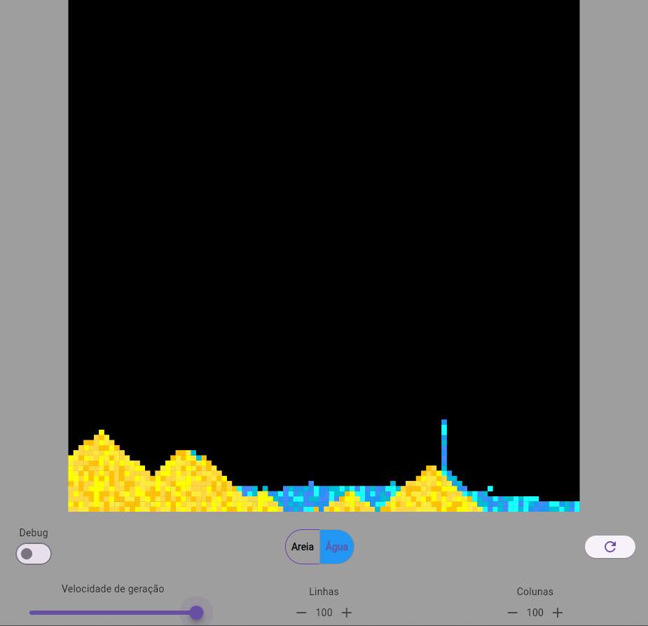

# sand

Um pequeno simulador de grãos por pixel que calcula o efeito de gravidade de água e areia.

## Objetivo

Criar um sistema de queda de areia com base na grade de pixels
Inspiração for retirada do vídeo do Coding Train <https://www.youtube.com/watch?v=L4u7Zy_b868>, apesar da implementação não ter relação

## Estrutura

Foi utilizado signals para o gerencialmente de Estado.

As pastas foram separas em presentation e domain:
-Domain: contém as entidades do domínio, como o objeto Grãos, o objeto Grãos que representa a água e o objeto Grãos que representa a areia.
-Presentation: Um único arquivo com toda a tela inicial

## Regras

Para a areia estabeleci que ela cairá até ter uma areia sob ela (inclusive atravessando a água) e caso encontre uma areia tenta se mover para os lados e para baixo randomicamente, se ambos os lados já estiverem ocupados ela para.

Para a água estabeleci que ela cairá até encontrar uma areia ou uma água, quando isso acontecer ela tentará ir para um dos lados aleatoriamente até encontrar um obstáculo.

## Para rodar o projeto

O projeto foi feito, testado e pensado em uma plataforma windows, mas também pode ser utilizado em um navegador apesar do desempenho ser inferior.

<https://www.sandfall.web.app>

